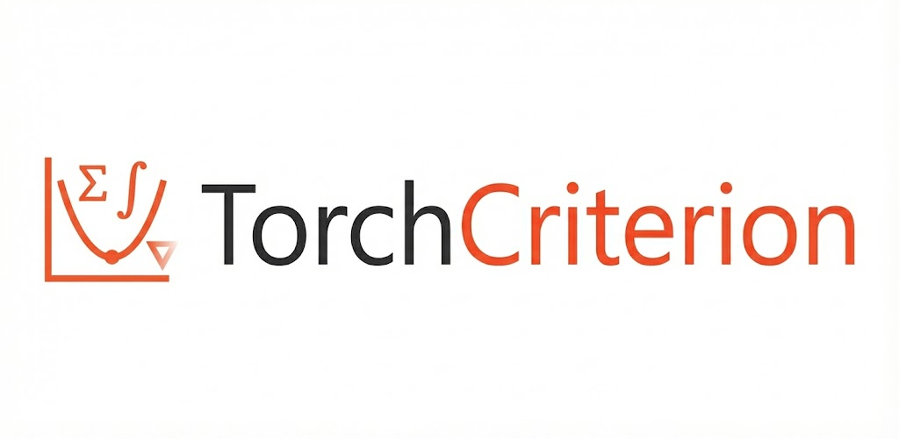

# TorchCriterion

<p align="center">
  <a href="https://github.com/Liodon-AI/TorchCriterion">
    
  </a>
</p>

**torchcriterion** is a modular, extensible library of PyTorch-compatible loss functions ("criteria") for classification, regression, segmentation, and metric learning tasks. It offers a curated collection of both standard and custom loss functions, built with flexibility and composability in mind.

---

## 🚀 Features

- 🧱 Modular architecture for clean API and extension
- 🧪 Ready-to-use implementations of popular losses
- 🧩 Supports multi-loss composition and custom scheduling
- ⚡ Fully compatible with PyTorch’s autograd and GPU acceleration

---

## 📦 Installation

```bash
pip install torchcriterion
```

---

## 🧰 Supported Losses

### Classification
- `CrossEntropyLoss`
- `FocalLoss`

### Regression
- `MSELoss`
- `HuberLoss`

### Segmentation
- `DiceLoss`
- `TverskyLoss`

### Metric Learning
- `TripletLoss`
- `ContrastiveLoss`

### NLP Metrics (new)

Under `torchcriterion.nlp` we provide common NLP evaluation metrics.

Example usage:

```python
from torchcriterion.nlp.bleu import bleu_score
from torchcriterion.nlp.rouge import rouge_l_batch
from torchcriterion.nlp.perplexity import perplexity

preds = ["the cat sat on mat"]
refs  = ["the cat is on the mat"]

print("BLEU:", bleu_score(preds, refs))
print("ROUGE-L:", rouge_l_batch(preds, refs))

# LM perplexity example
logits = model_out  # (batch, seq_len, vocab)
targets = labels    # (batch, seq_len)
print("Perplexity:", perplexity(logits, targets))

---

## 🧪 Example Usage

```
python
from torchcriterion import FocalLoss

criterion = FocalLoss(gamma=2.0, alpha=0.25)
loss = criterion(predictions, targets)
```

---

## 📁 Project Structure

```
torchcriterion/
├── classification/
│   ├── cross_entropy.py
│   ├── focal.py
├── regression/
│   ├── mse.py
│   ├── huber.py
├── segmentation/
│   ├── dice.py
│   ├── tversky.py
├── metric_learning/
│   ├── triplet.py
│   ├── contrastive.py
├── nlp/
│   ├── bleu.py
│   ├── perplexity.py
│   ├── rouge.py
├── base.py
├── __init__.py
```

---

## 📜 License

This project is licensed under the **MIT License**. See the `LICENSE` file for details.

---

## 🙌 Contributing

Pull requests, ideas, and issues are welcome! Feel free to open a PR or start a discussion.

---

## 👤 Author

Developed by Liodon AI

---

## ⭐️ Star the Repo

If you find this library useful, please consider starring it to show your support!

---

## 🔗 Related Projects

- [torchmetrics](https://github.com/Lightning-AI/torchmetrics) — for evaluation metrics
- [timm](https://github.com/huggingface/pytorch-image-models) — for models with built-in loss support

---

## 📚 Citation

If you use **TorchCriterion** in your research or project, please consider citing it:

```bibtex
@misc{torchcriterion2025,
  title        = {TorchCriterion: Advanced Loss Functions for PyTorch},
  year         = {2025},
  publisher    = {GitHub},
  howpublished = {\url{https://github.com/Liodon-AI/TorchCriterion}},
  note         = {GitHub repository},
}
```

Made with ❤️ and PyTorch
